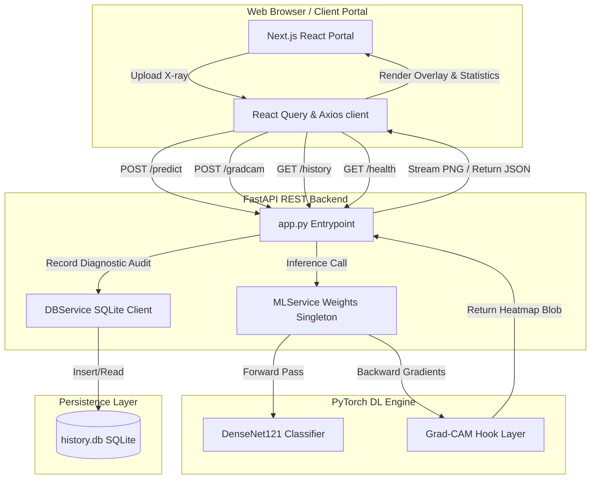

# ChestDiseaseAI – Production Clinical Diagnosis Platform

ChestDiseaseAI is a production-grade clinical Chest X-ray Disease Detection & Explainability Platform. It integrates a config-driven PyTorch deep learning pipeline, a RESTful FastAPI backend with history persistence, and a modern responsive dashboard built with React + Next.js.

---

## 1. System Architecture

The platform follows clean architecture principles, separating the core machine learning inference, persistent storage, API request validation, and UI visualization layer.

### System Data Flow



---

## 2. Directory Structure

```
ChestDiseaseAI/
│
├── backend/                  # FastAPI Application & REST APIs
│   ├── app.py                # Main server setup & CORS middleware
│   ├── database.py           # SQLite connection & session creator
│   ├── models.py             # SQLAlchemy history schema
│   ├── schemas.py            # Pydantic schema request/response types
│   ├── dependencies.py       # Injectable model singletons and DB sessions
│   ├── Dockerfile            # Container definition for FastAPI server
│   └── services/
│       ├── ml_service.py     # Inference preprocessing, inference, and Grad-CAM
│       └── db_service.py     # Database CRUD tracking logs
│
├── frontend/                 # React + Next.js Web Dashboard
│   ├── src/
│   │   ├── app/              # App router (login, dashboard, upload, history, settings)
│   │   ├── components/       # Reusable components (Navbar, loaders)
│   │   └── services/         # Axios client requesting backend predictions
│   ├── Dockerfile            # Container definition for Client Portal
│   └── package.json
│
├── ml/
│   └── chest_ai/             # PyTorch Machine Learning Codebase
│       ├── __init__.py       # Exposes Settings config & rotating logger
│       ├── config.py         # Config-driven Pydantic setting overrides
│       ├── dataset.py        # BaseDataset and CheXpert multi-label dataset loaders
│       ├── dataloader.py     # Imbalance-weighted training loader creators
│       ├── transforms.py     # Albumentations pipelines
│       ├── model.py          # DenseNet121 & multi-backbone classification heads
│       ├── loss.py           # Masked BCE loss supporting U-Ignore uncertainty masking
│       ├── trainer.py        # Trainer loops with AMP, Tensorboard, early stopping
│       ├── train.py          # CLI entrypoint for model training
│       ├── checkpoint.py     # Checkpoint save/load and state manager
│       ├── metrics.py        # AUROC / F1 calculator excluding masked indices
│       ├── gradcam.py        # Backward hook gradient feature selectors
│       ├── visualization.py  # OpenCV blending JET colormap overlay generators
│       └── evaluate.py       # Batch validation curves & HTML Dashboard generator
│
├── tests/                    # Pytest verification suites
│   ├── test_data_pipeline.py # Data loader and transform checks
│   ├── test_training_pipeline.py # Model forward, loss, optimizer, trainer checks
│   ├── test_eval_pipeline.py # Grad-CAM hooks, matrices, evaluations checks
│   └── test_backend.py       # API route, DB log writes, mock upload checks
│
├── docker-compose.yml        # Multi-container production orchestrator
├── requirements.txt          # Root Python dependencies list
└── pyproject.toml            # Ruff linter configs and pytest hooks
```

---

## 3. REST API Specifications

The FastAPI backend exposes swagger docs at `/docs` (redirected from base root `/`).

| HTTP Method | Endpoint | Description | Request Payload | Response format |
|:---|:---|:---|:---|:---|
| **GET** | `/api/v1/health` | Diagnostic server health | None | `HealthResponse` (JSON) |
| **POST** | `/api/v1/predict` | Upload scan for disease predictions | `file` (Multipart), `patient_id` (Form) | `PredictionResponse` (JSON) |
| **POST** | `/api/v1/gradcam` | Generate Grad-CAM PNG heatmap overlay | `file` (Multipart), `target_class` (Form) | `image/png` (Binary stream) |
| **GET** | `/api/v1/history` | Retrieve log of clinician diagnoses | `patient_id` (Query), `limit` (Query) | `List[PredictionResponse]` |

---

## 4. Setup and Run Guide

### Option A: Quick-Run with Docker Compose (Recommended)

Ensure you have Docker and Docker Compose installed:
```bash
# Build images and spin up services
docker compose up --build
```
- **Clinician Dashboard Portal:** Access at [http://localhost:3000](http://localhost:3000)
- **API Swagger Docs:** Access at [http://localhost:8000/docs](http://localhost:8000/docs)

### Option B: Local Manual Development Run

#### 1. Setup Backend & ML Pipelines
```bash
# Install root dependencies
pip install -r requirements.txt

# Run pytest verification suite (all 23 tests)
python -m pytest tests/

# Launch FastAPI backend
uvicorn backend.app:app --host 127.0.0.1 --port 8000
```

#### 2. Setup Client Next.js Portal
In a separate terminal:
```bash
cd frontend
# Install npm dependencies
npm install

# Run dev server
npm run dev
```
Open browser at [http://localhost:3000](http://localhost:3000).

---

## 5. Environment Variables Configuration

The project reads configurations using Pydantic Settings. You can create a `.env` file in the root to override these defaults:

| Variable Name | Default Value | Description |
|:---|:---|:---|
| `CHEST_AI_DATA_DIR` | `./data/CheXpert-v1.0-small` | Directory path where CheXpert datasets are expected |
| `CHEST_AI_CHECKPOINT_DIR` | `./ml/checkpoints` | Model weights exporter folder |
| `CHEST_AI_DEVICE` | `cpu` | PyTorch execution target (`cpu`, `cuda`, `mps`) |
| `CHEST_AI_UNCERTAINTY_POLICY` | `U-Zeros` | Uncertainty policy (`U-Zeros`, `U-Ones`, `U-Ignore`) |
| `NEXT_PUBLIC_API_URL` | `http://localhost:8000/api/v1` | (Frontend) Target server API URL |
